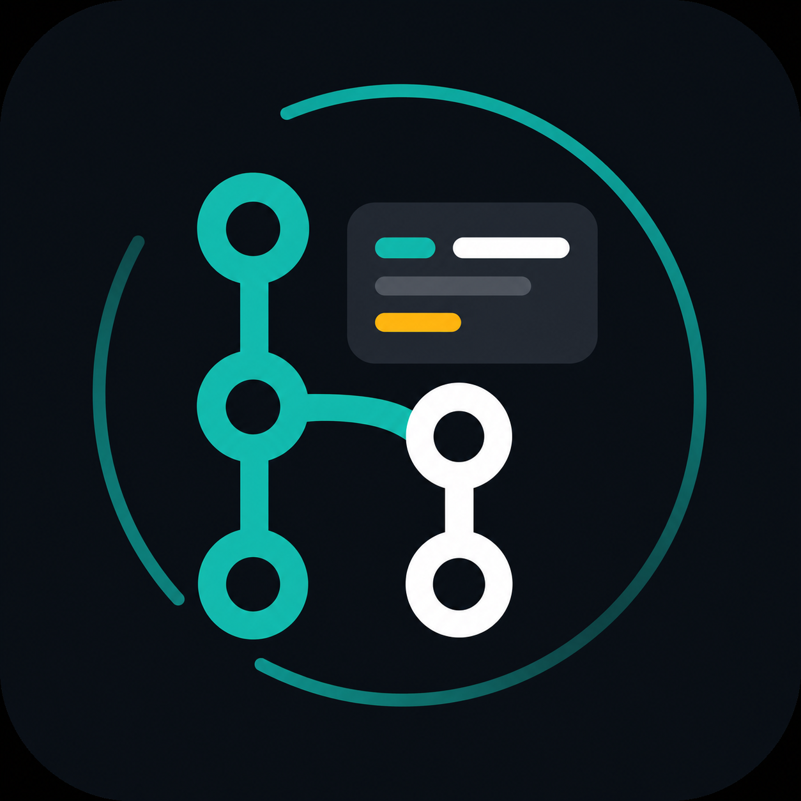

# Git

These skills create Conventional Commits and drive GitHub or GitLab change requests from operational
preparation through automated review and verified merge cleanup.

`address-pr-feedback` requires the `engineering` plugin so it can apply
`engineering:receiving-feedback`.

An agent can invoke every skill implicitly. Each skill stops at a hand off that recommends the next
workflow, and the agent continues into that workflow only when the user's request already asked for
that outcome, or for a later outcome that requires it, so `merge-pr` merges only when the user's
request asks to merge the change request.

`tidy-history` rewrites a topic branch and publishes it with `--force-with-lease` without asking, so
`create-pr` and `address-pr-feedback` keep history tidy as they push. On `main`, the remote's
default branch, or the change request's target, it only reports its plan.

Conflict resolution is intentionally outside these lifecycle skills; `create-pr` and `merge-pr` stop
and report when a merge or a rebase would require it.

## Skills

- `commit`: Inspect, partition, stage, and commit current changes with Conventional Commit messages.
  Detailed specification notes live in `skills/commit/references/`.
- `tidy-history`: Fold, split, reorder, and reword a topic branch's commits without changing its
  final tree, then force-push the result with `--force-with-lease`.
- `create-pr`: Prepare a branch operationally, create or refresh its pull request or merge request,
  and observe initial CI.
- `address-pr-feedback`: Drive active automated-review adapters to current-head approval or a
  clearly reported exception.
- `merge-pr`: Enforce forge-native merge gates, select a merge method, verify the remote merge, and
  clean up local and remote branch state.
